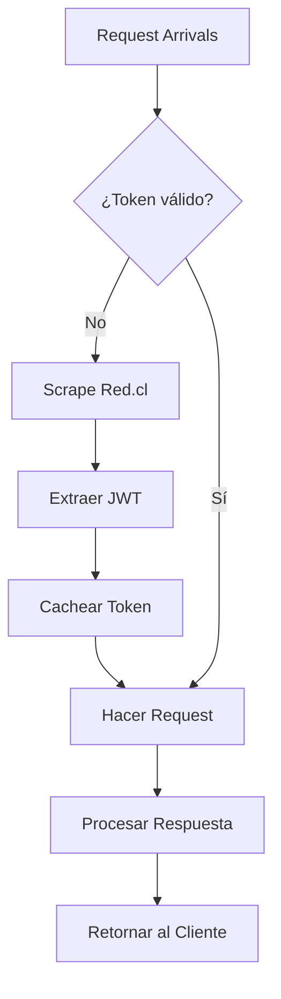

# 🚀 LlegaPo' Servidor

API moderna en Express/Bun que consume las APIs internas de Red.cl para proporcionar información de transporte público de Santiago de Chile en tiempo real.

## 🎯 Características Principales

- **🚍 Tiempos de llegada en tiempo real** por paradero
- **🎯 Arrivals por servicio específico** - Filtrar por código de micro
- **🛣️ Recorridos completos** con coordenadas, paraderos y horarios
- **📊 Análisis mejorado** de arrivals con estadísticas
- **🛡️ Rate limiting inteligente** para proteger los servicios
- **🔄 Cache JWT optimizado** para reducir requests
- **✨ Respuestas formateadas** para mejor experiencia de usuario
- **📖 Documentación automática** en todos los endpoints
- **🔒 Seguridad robusta** con Helmet.js, CORS y validaciones

## 📋 Endpoints Disponibles

### 🚍 Paraderos y Arrivals

| Endpoint | Descripción | Rate Limit | Nuevo |
|----------|-------------|------------|-------|
| `GET /v1/stops/:codsimt/arrivals` | Tiempos de llegada básicos | 5 req/min | |
| `GET /v1/stops/:codsimt/arrivals/busId?busId=XXX` | **Arrivals de servicio específico** | 5 req/min | ✨ |
| `GET /v1/stops/:codsimt/arrivals/formatted` | Arrivals formateados y legibles | 5 req/min | |
| `GET /v1/stops/:codsimt/enhanced` | **Arrivals con análisis avanzado** | 5 req/min | ✨ |
| `GET /v1/stops/:codsimt/info` | Información general del paradero | 5 req/min | ✨ |
| `GET /v1/stops/:codsimt/statistics` | **Estadísticas del paradero** | 5 req/min | ✨ |

### 🛣️ Rutas y Recorridos

| Endpoint | Descripción | Rate Limit |
|----------|-------------|------------|
| `GET /v1/routes/:codser` | Recorrido básico (ida o regreso) | 10 req/5min |
| `GET /v1/routes/:codser/formatted` | Recorrido formateado | 10 req/5min |
| `GET /v1/routes/:codser/full` | Recorrido completo (ida Y regreso) | 10 req/5min |
| `GET /v1/routes/:codser/stops` | Solo paraderos del servicio | 10 req/5min |
| `GET /v1/routes/:codser/search?search=termino` | **Buscar paraderos en recorrido** | 10 req/5min |
| `GET /v1/routes/:codser/schedules` | **Horarios del servicio** | 10 req/5min |
| `GET /v1/routes/:codser/info` | **Información del servicio** | 10 req/5min |
| `GET /v1/routes/:codser/compare?compare=otro` | **Comparar servicios** | 10 req/5min |

### 🏥 Sistema y Utilidades

| Endpoint | Descripción |
|----------|-------------|
| `GET /` | Documentación interactiva de la API |
| `GET /health` | Estado detallado del servicio |
| `GET /v1/endpoints` | **Lista todos los endpoints disponibles** |
| `GET /v1/system/stats` | **Estadísticas del sistema** |
| `GET /ping` | Test de conectividad simple |
| `GET /version` | **Información de la versión** |

## 🚀 Instalación y Configuración

### Prerrequisitos

- **Bun** 1.0+ (recomendado)
- bun para gestión de paquetes

### Instalación Rápida

```bash
# Clonar el repositorio
git clone <tu-repo-url>
cd llegapo-servidor

# Instalar dependencias con Bun
bun install

# Ejecutar en desarrollo
bun dev

# Compilar y ejecutar en producción
bun run build && bun start
```

### Variables de Entorno

```bash
# Servidor
PORT=3000                    # Puerto del servidor
HOST=localhost              # Host del servidor  
NODE_ENV=development         # Entorno (development/production)

# Seguridad
ALLOWED_ORIGINS=*           # CORS origins (separados por coma)
API_KEY_REQUIRED=false      # Requiere API key (futuro)

# Rate Limiting (opcional)
ARRIVALS_RATE_LIMIT=5       # Requests por minuto para arrivals
ROUTES_RATE_LIMIT=10        # Requests por 5 minutos para routes
```

## 🧪 Ejemplos de Uso Detallados

### 🚍 Arrivals Básicos

```bash
curl http://localhost:3000/v1/stops/PC205/arrivals
```

**Respuesta:**
```json
{
  "success": true,
  "data": [
    {
      "servicio": "405",
      "destino": "Cantagallo",
      "distanciabus1": "2071",
      "horaprediccionbus1": "Entre 5 Y 9 min",
      "ppubus1": "PFYG-91",
      "distanciabus2": "3637",
      "horaprediccionbus2": "Entre 9 Y 13 min",
      "ppubus2": "PFVL-16"
    },
    {
      "servicio": "108",
      "destino": "La Florida",
      "distanciabus1": "Llegando",
      "horaprediccionbus1": "16:45",
      "ppubus1": "FLXP76"
    }
  ],
  "timestamp": 1765412361685
}
```

### 🎯 Arrivals por Servicio Específico (¡NUEVO!)

```bash
curl "http://localhost:3000/v1/stops/PC205/arrivals/busId?busId=405"
```

**Respuesta:**
```json
{
  "success": true,
  "data": {
    "paradero": "PC205",
    "servicio": "405",
    "arrivals": [
      {
        "servicio": "405",
        "destino": "Cantagallo",
        "distanciabus1": "2071",
        "horaprediccionbus1": "Entre 5 Y 9 min",
        "ppubus1": "PFYG-91",
        "distanciabus2": "3637",
        "horaprediccionbus2": "Entre 9 Y 13 min",
        "ppubus2": "PFVL-16"
      }
    ],
    "totalBuses": 2,
    "buses": [
      {
        "numero": 1,
        "distancia": "2071",
        "tiempoLlegada": "Entre 5 Y 9 min",
        "ppu": "PFYG-91"
      },
      {
        "numero": 2,
        "distancia": "3637",
        "tiempoLlegada": "Entre 9 Y 13 min",
        "ppu": "PFVL-16"
      }
    ]
  },
  "timestamp": 1765412361685
}
```

### 📊 Arrivals con Análisis (¡NUEVO!)

```bash
curl http://localhost:3000/v1/stops/PC205/enhanced
```

**Respuesta:**
```json
{
  "success": true,
  "data": {
    "paradero": "PC205",
    "totalServicios": 3,
    "arrivals": [
      {
        "servicio": "405",
        "destino": "Cantagallo",
        "buses": [
          {
            "distancia": "Entre 5 Y 9 min",
            "tiempo": "16:45",
            "patente": "PFYG-91",
            "esProximo": true
          }
        ]
      }
    ],
    "analisis": {
      "busesLlegando": 1,
      "busesProximos": 2,
      "servicioMasRapido": "405",
      "tiempoPromedioEspera": "7 minutos"
    },
    "resumen": "3 servicios activos, próximo bus en 5 minutos"
  },
  "timestamp": 1765412361685
}
```

### 📈 Estadísticas de Paradero (¡NUEVO!)

```bash
curl "http://localhost:3000/v1/stops/PC205/statistics?samples=5&interval=10000"
```

**Respuesta:**
```json
{
  "success": true,
  "data": {
    "paradero": "PC205",
    "totalMuestras": 5,
    "intervaloSegundos": 10,
    "serviciosDetectados": ["405", "108", "B19"],
    "estadisticas": {
      "serviciosMasComunes": [
        { "servicio": "405", "frecuencia": 5 },
        { "servicio": "108", "frecuencia": 4 }
      ],
      "promedioServiciosPorMuestra": 3.2,
      "totalBusesDetectados": 16
    },
    "historico": [
      {
        "timestamp": 1765412361685,
        "totalServicios": 3,
        "servicios": ["405", "108", "B19"]
      }
    ],
    "resumen": "Paradero PC205: 3 servicios únicos detectados en 5 muestras. Promedio: 3.2 arrivals por consulta."
  },
  "timestamp": 1765412361685
}
```

### 🛣️ Recorrido Completo

```bash
curl http://localhost:3000/v1/routes/405/full
```

**Respuesta:**
```json
{
  "success": true,
  "data": {
    "servicio": "405",
    "resumen": {
      "tieneIda": true,
      "tieneRegreso": true,
      "totalParaderosIda": 45,
      "totalParaderosRegreso": 43,
      "comunasUnicas": ["Maipú", "Santiago", "Providencia"]
    },
    "ida": {
      "destino": "Cantagallo",
      "paraderos": [...],
      "coordenadas": [...]
    },
    "regreso": {
      "destino": "Maipú",
      "paraderos": [...],
      "coordenadas": [...]
    }
  },
  "timestamp": 1765412361685
}
```

### 🔍 Buscar en Recorrido (¡NUEVO!)

```bash
curl "http://localhost:3000/v1/routes/405/search?search=baquedano"
```

**Respuesta:**
```json
{
  "success": true,
  "data": {
    "servicio": "405",
    "terminoBusqueda": "baquedano",
    "totalEncontrados": 2,
    "resultados": [
      {
        "codigo": "PC205",
        "nombre": "Plaza Baquedano",
        "comuna": "Providencia",
        "ubicacion": {
          "latitud": -33.4372,
          "longitud": -70.6506
        },
        "orden": 15
      }
    ]
  },
  "timestamp": 1765412361685
}
```

## 🔧 Estructura del Proyecto

```
llegapo-servidor/
├── src/
│   ├── controllers/         # Controladores de endpoints
│   │   ├── appController.ts      # Health, docs, sistema
│   │   ├── stopController.ts     # Paraderos y arrivals
│   │   └── routeController.ts    # Rutas y recorridos
│   ├── services/           # Lógica de negocio
│   │   ├── stopService.ts       # Servicio de paraderos
│   │   └── routeService.ts      # Servicio de rutas
│   ├── middleware/         # Middlewares personalizados
│   │   ├── security.ts          # Seguridad y rate limiting
│   │   └── error-handler.ts     # Manejo de errores
│   ├── utils/              # Utilidades
│   │   ├── red-client.ts        # Cliente para Red.cl
│   │   ├── formatters.ts        # Formateadores de datos
│   │   └── validators.ts        # Validadores de entrada
│   ├── types/              # Definiciones de tipos
│   │   └── index.ts
│   └── app.ts              # Aplicación principal
├── dist/                   # Código compilado (producción)
├── package.json           # Dependencias y scripts
├── tsconfig.json          # Configuración de TypeScript
├── README.md             # Este archivo
└── bun.lock              # Lock file
```

## 🛡️ Seguridad y Rate Limiting

### Rate Limits Aplicados

| Categoría | Límite | Ventana | Descripción |
|-----------|--------|---------|-------------|
| **Arrivals** | 5 requests | 1 minuto | Endpoints de tiempos de llegada |
| **Routes** | 10 requests | 5 minutos | Endpoints de recorridos |
| **General** | 100 requests | 15 minutos | Rate limit global para toda la API |

**Nota**: En desarrollo (localhost), los rate limits están relajados.

### Headers de Seguridad

- **Helmet.js**: Headers de seguridad automáticos
- **CORS**: Configurable por environment
- **Content Security Policy**: Prevención de XSS
- **HSTS**: Fuerza HTTPS en producción
- **Rate Limiting**: Por IP y endpoint

### Validaciones de Entrada

**Códigos de Paradero (`codsimt`):**
- ✅ Mínimo 3 caracteres, máximo 10
- ✅ Solo caracteres alfanuméricos
- ✅ Ejemplos válidos: `PC205`, `PA422`, `MA501`

**Códigos de Servicio (`codser`):**
- ✅ Mínimo 1 carácter, máximo 10
- ✅ Letras, números, guiones y guiones bajos
- ✅ Ejemplos válidos: `405`, `B19`, `RED-1`

## ⚡ Performance y Optimizaciones

### Cache JWT Inteligente
- 🔄 Token JWT cacheado automáticamente
- ⏰ Renovación antes de experar (5 min TTL)
- 🎭 Headers User-Agent realistas
- 📊 Métricas de cache hits/misses

### Optimizaciones de Requests
- ⏱️ Timeout de 30 segundos configurables
- 🔄 Retry automático en errores de red
- 📝 Logging detallado pero eficiente
- ✅ Validación previa evita requests innecesarios

### TypeScript y Tipado Fuerte
- 🛡️ Validación en tiempo de compilación
- 📖 IntelliSense completo
- 🔧 Refactoring seguro
- 🚀 Mejor experiencia de desarrollo

## 🐛 Manejo de Errores

### Códigos de Estado HTTP

| Código | Descripción | Cuándo Ocurre | Solución |
|--------|-------------|---------------|----------|
| **200** | ✅ Éxito | Request procesado correctamente | - |
| **400** | ❌ Parámetros inválidos | Código de paradero mal formateado | Verificar formato de parámetros |
| **404** | ❌ No encontrado | Servicio no existe en paradero | Verificar que el servicio pase por ese paradero |
| **429** | ⚠️ Rate limit excedido | Demasiadas requests muy rápido | Esperar y reintentar |
| **500** | 💥 Error interno | Red.cl no disponible | Verificar estado de Red.cl |

### Formato Estándar de Error

```json
{
  "success": false,
  "error": "Descripción clara del error",
  "timestamp": 1765412361685,
  "data": {
    "paradero": "PC205",
    "servicio": "999",
    "arrivals": [],
    "totalBuses": 0,
    "buses": []
  }
}
```

## 📊 Monitoreo y Observabilidad

### Health Check Avanzado

```bash
curl http://localhost:3000/health
```

**Respuesta completa:**
```json
{
  "status": "ok",
  "service": "LlegaPo Servidor",
  "version": "1.0.0",
  "timestamp": 1765412361685,
  "uptime": 3600.5,
  "memory": {
    "rss": "175.1 MB",
    "heapTotal": "105.8 MB", 
    "heapUsed": "103.8 MB",
    "external": "9.0 MB"
  },
  "endpoints": {
    "arrivals": "/v1/stops/:codsimt/arrivals",
    "arrivalsByService": "/v1/stops/:codsimt/arrivals/busId",
    "route": "/v1/routes/:codser"
  },
  "system": {
    "bunVersion": "v1.x.x",
    "platform": "win32",
    "arch": "x64",
    "uptimeFormatted": "1h 0m 0s"
  },
  "redClient": {
    "jwtCache": {
      "hasToken": true,
      "expiresIn": 243,
      "isValid": true
    }
  }
}
```

### Descubrimiento de Endpoints

```bash
curl http://localhost:3000/v1/endpoints
```

**Respuesta:**
```json
{
  "success": true,
  "data": {
    "message": "Endpoints disponibles en la API",
    "totalEndpoints": 19,
    "endpoints": {
      "stops": {
        "arrivals": "http://localhost:3000/v1/stops/:codsimt/arrivals",
        "arrivalsByService": "http://localhost:3000/v1/stops/:codsimt/arrivals/busId?busId=XXX",
        "enhanced": "http://localhost:3000/v1/stops/:codsimt/enhanced",
        "statistics": "http://localhost:3000/v1/stops/:codsimt/statistics"
      },
      "routes": {
        "search": "http://localhost:3000/v1/routes/:codser/search?search=termino"
      }
    },
    "examples": {
      "stopArrival": "http://localhost:3000/v1/stops/PC205/arrivals",
      "stopArrivalByService": "http://localhost:3000/v1/stops/PC205/arrivals/busId?busId=405"
    }
  }
}
```

## 🔄 Scripts y Comandos

```bash
# Desarrollo
bun dev             # Servidor con hot reload

# Producción  
bun run build       # Compilar TypeScript
bun start          # Ejecutar versión compilada
bun run clean      # Limpiar archivos compilados

# Testing
bun test           # Ejecutar tests de API
bun run test:perf  # Tests de rendimiento
```

## 🌐 Integración con Red.cl

### APIs Consumidas

#### 1. Predictor de Arrivals
- **URL**: `https://www.red.cl/predictorPlus/prediccion`
- **Auth**: JWT Token (obtenido por scraping)
- **Método**: POST
- **Rate Limit**: Respetamos 1 req/segundo

#### 2. Información de Recorridos  
- **URL**: `https://www.red.cl/restservice_v2/rest/conocerecorrido`
- **Auth**: No requiere
- **Método**: GET
- **Cache**: 1 hora por recorrido

### Flujo de Autenticación



## ⚠️ Consideraciones Importantes

### ⚖️ Términos de Uso
- 🔴 **Solo para uso educativo/personal**
- 🔴 **NO usar comercialmente sin autorización**
- ✅ Respetar rate limits de Red.cl
- ✅ No hacer scraping agresivo

### 🔧 Limitaciones Técnicas
- Dependiente de Red.cl (single point of failure)
- Sin persistencia histórica de datos
- Cache en memoria (se pierde al reiniciar)
- Sin clustering horizontal

### 🚀 Roadmap Futuro

#### v2.0 (Próximamente)
- [ ] 🗄️ Cache con Redis
- [ ] 📊 Métricas con Prometheus/Grafana  
- [ ] 🔑 Sistema de API Keys
- [ ] 🔄 WebSockets para tiempo real
- [ ] 🐳 Docker containerization

#### v2.1
- [ ] 🧪 Test suite completo
- [ ] 📡 Fallback a múltiples fuentes
- [ ] 🎯 ML para predicciones mejoradas
- [ ] 🌍 Soporte internacional (otras ciudades)

#### v3.0
- [ ] 🏗️ Microservicios architecture
- [ ] ☁️ Deploy en Kubernetes
- [ ] 📱 SDK para móviles
- [ ] 🔄 CI/CD completo

## 📊 Casos de Uso Reales

### 🚍 Aplicación de Arrivals
```javascript
// Obtener próximos buses del paradero más cercano
const response = await fetch('http://localhost:3000/v1/stops/PC205/arrivals');
const { data } = await response.json();

// Filtrar solo buses que llegan en < 10 min
const proximosBuses = data.filter(bus => 
  bus.distanciabus1.includes('min') && 
  parseInt(bus.distanciabus1) < 10
);
```

### 🎯 Widget de Servicio Específico
```javascript
// Widget para mostrar solo el servicio 405
const response = await fetch('http://localhost:3000/v1/stops/PC205/arrivals/busId?busId=405');
const { data } = await response.json();

document.getElementById('bus-405').innerHTML = 
  `Próximo 405: ${data.buses[0].tiempoLlegada}`;
```

### 📊 Dashboard de Estadísticas
```javascript
// Monitoreo en tiempo real de un paradero
const stats = await fetch('http://localhost:3000/v1/stops/PC205/statistics?samples=10');
const { data } = await stats.json();

console.log(`Servicios más frecuentes:`, data.estadisticas.serviciosMasComunes);
```

## 🧪 Testing

### Test de Conectividad
```bash
curl http://localhost:3000/ping
# Respuesta: {"message":"pong","timestamp":1765412361685}
```

### Test de Carga Básica
```bash
# Enviar 10 requests en paralelo
for i in {1..10}; do
  curl -s http://localhost:3000/v1/stops/PC205/arrivals &
done
wait
```

### Validación de Rate Limits
```bash
# Probar límite de arrivals (5/min)
for i in {1..6}; do
  echo "Request $i:"
  curl -w "\nStatus: %{http_code}\n" http://localhost:3000/v1/stops/PC205/arrivals
  sleep 5
done
```

## 🤝 Contribución

### Configuración de Desarrollo

1. **Fork** del proyecto
2. **Clone** tu fork
3. **Instalar** dependencias: `bun install`
4. **Ejecutar** en dev: `bun dev`
5. **Crear branch**: `git checkout -b feature/nueva-funcionalidad`

### Estándares de Código

- ✅ **TypeScript strict mode** habilitado
- ✅ **ESLint + Prettier** (próximamente)
- ✅ **Conventional Commits**: `feat:`, `fix:`, `docs:`
- ✅ **Tests unitarios** para nuevas features
- ✅ **Documentación** actualizada

### Pull Request Process

1. 🔄 Asegurar que tests pasen
2. 📝 Actualizar documentación
3. ✨ Seguir convenciones de código
4. 🧪 Probar manualmente endpoints
5. 📋 Descripción clara en el PR

## 📄 Tecnologías y Stack

### Backend Core
- **Runtime**: Bun 1.0+ (recomendado)
- **Framework**: Express.js 4.18+
- **Language**: TypeScript 5.0+
- **HTTP Client**: Axios

### Seguridad y Middleware  
- **Security Headers**: Helmet.js
- **CORS**: express-cors
- **Rate Limiting**: express-rate-limit
- **Request Logging**: Morgan
- **Body Parsing**: express.json

### Desarrollo y Build
- **Transpilation**: TypeScript Compiler
- **Process Manager**: Bun watch (dev)
- **Package Manager**: Bun
- **Linting**: ESLint (próximamente)

## 🔗 Enlaces Relacionados

- 🌐 [Red.cl Oficial](https://www.red.cl/)
- 🚌 [DTPM - Directorio de Transporte](https://www.dtpm.cl/)
- 📖 [Express.js Docs](https://expressjs.com/)
- ⚡ [Bun Documentation](https://bun.sh/docs)
- 🔷 [TypeScript Handbook](https://www.typescriptlang.org/docs/)

## 📄 Licencia

**ISC License** - Libre para uso personal y educativo.

Para uso comercial, contactar al maintainer.

---

## 🎉 ¿Te Resultó Útil?

Si este proyecto te ayudó, considera:

- ⭐ **Star** en GitHub
- 🐛 **Reportar bugs** via Issues  
- 💡 **Sugerir features** via Discussions
- 🤝 **Contribuir** con Pull Requests
- ☕ **Invitar un café** al dev

---

**Desarrollado con ❤️ para la comunidad de transporte público de Santiago** 🚍🇨🇱

> **"Making public transport data accessible to everyone"**

¿Dudas? ¡Abre un issue o envía un PR! 🚀